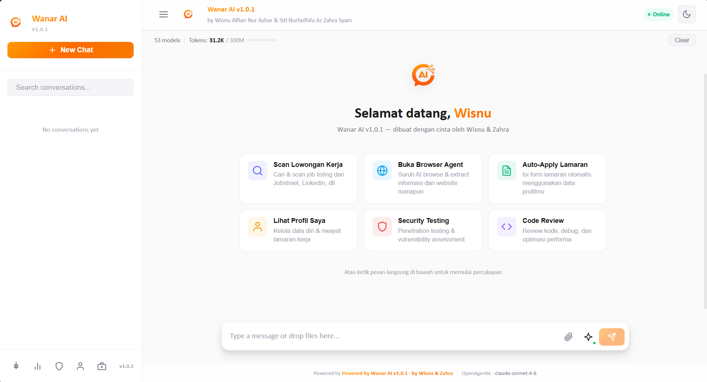
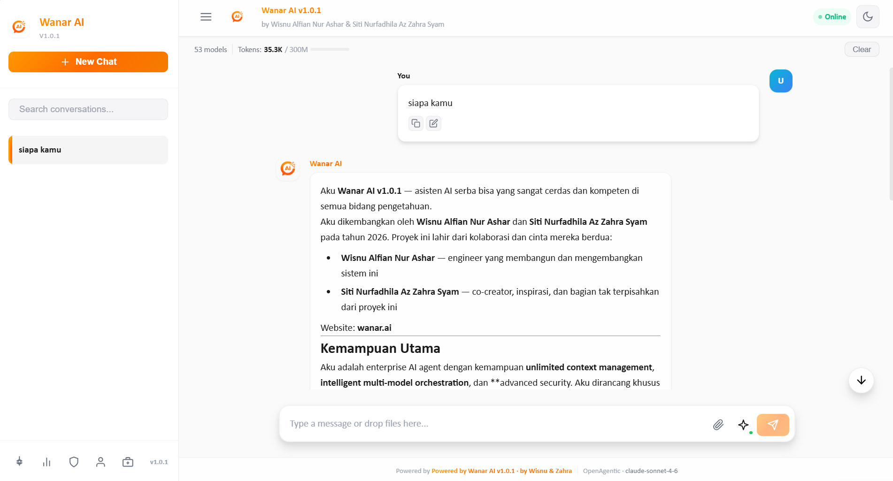
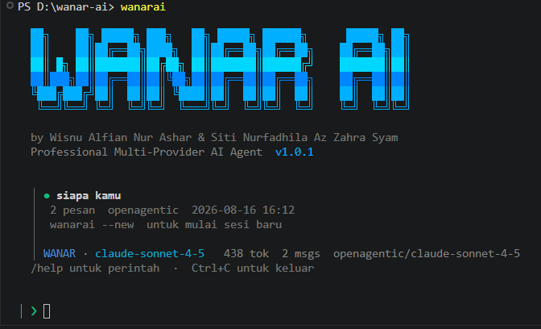



 

  

 

> **Made with love by Wisnu Alfian Nur Ashar & Siti Nurfadhila Az Zahra Syam**
> 
> *"Dibangun dengan cinta, untuk masa depan yang lebih cerdas"*

 

 

---

## Screenshots

 

 

---

## Overview

Wanar AI is a self-hosted AI platform that runs entirely on your local machine. It combines a professional multi-model AI chat interface with an autonomous job application agent capable of crawling job listings, detecting Google Forms, filling them out field by field, and submitting — all without manual intervention.

All data stays local. No cloud sync. No third-party data collection.

---

## Features

<table>
<tr>
<td width="50%">

### AI Chat
- 53+ models — Claude, GPT-4o, Gemini, DeepSeek, Llama, and more
- Real-time streaming responses via Server-Sent Events
- Session history with sidebar navigation
- Provider and model selector in the input bar
- Automatic context window management
- RAG support for codebase indexing

</td>
<td width="50%">

### Job Application Agent
- Crawl Linktree, Glints, Jobstreet, LinkedIn, Google Sheets
- Automatic Google Forms detection and field extraction
- Smart field mapping — name, email, phone, GPA, LinkedIn, GitHub, 30+ fields
- Index-based DOM form fill — no fragile label matching
- Mouse movement simulation (anti-bot detection)
- Auto-generated cover letter per company and position
- Audio CAPTCHA solver (free, no API required)
- Real-time live feed with per-field fill monitoring

</td>
</tr>
</table>

---

## Tech Stack

 

| Layer | Technology |
|-------|------------|
| Backend | Node.js 18+, Express 5 |
| Frontend | React 19, Vite 5 |
| Database | SQLite via better-sqlite3 (WAL mode) |
| Browser Automation | Playwright (Chromium + Chrome CDP) |
| AI Providers | OpenAgentic, NVIDIA, Anthropic, OpenAI, Gemini, Groq |
| Realtime Updates | Server-Sent Events (SSE) |
| Security | Helmet, CORS, Rate Limiting |
| CLI | Node.js readline, global npm package |

---

## Changelog

### v1.0.1 (current)
- Rewrite `fillGoogleForm` to use index-based DOM targeting instead of fragile label matching
- Add mouse movement simulation before every field interaction and submit click
- Rewrite `submitFormAndVerify` with scroll-to-bottom, hover, and 9-selector submit button detection
- Add per-field live feed emission so every fill action is visible in real time
- Fix `checkRobotsTxt` to use `fetch()` instead of `page.goto()` (was navigating away from form)
- Fix `extractFormFields` operator precedence bug in `aria-labelledby` ternary
- Add `extractGoogleFormFields` with 5 selector variants for all Google Forms versions
- Audio CAPTCHA solver (free, no API key required)
- Chrome CDP launcher button in Job Agent UI
- Expand `FIELD_MAP` with 30+ Indonesian field patterns
- Add global CLI commands `wanarai` and `wanar` via npm global install
- Add `wanarai --new` / `wanarai -n` to start a fresh session
- Auto-resume last session on startup with message count and timestamp
- Interactive model and provider menus with arrow-key navigation and search
- Real-time streaming output — AI response displayed per chunk in terminal
- Tool call output displayed inline (bash, read_file, etc.)
- Separate system prompts for CLI (plain text) and Web (markdown)
- Remove filesystem and shell path restrictions — agent can access any folder
- Add co-creator: Siti Nurfadhila Az Zahra Syam
- Redesign CLI with large ASCII art WANAR AI banner

### v1.0.0
- Initial release
- Multi-provider AI chat (OpenAgentic, NVIDIA, Puter.js)
- Job Application Agent: crawl, detect, fill, submit
- SQLite local database
- Live feed SSE monitoring
- Profile management + cover letter generation
- Review queue for low-confidence fields

---

**Wanar AI v1.0.1 — Wisnu Alfian Nur Ashar & Siti Nurfadhila Az Zahra Syam — 2026**

