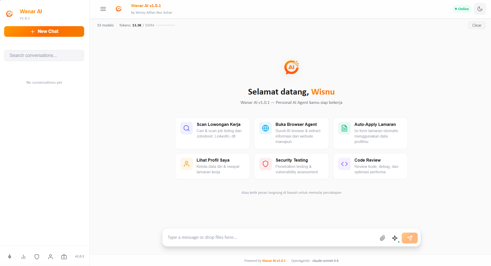

<div align="center">


# Wanar AI v2.0

**Enterprise AI Chat Platform + Autonomous Job Application Agent**

by Wisnu Alfian Nur Ashar


</div>

---



---

## Overview

Wanar AI is a self-hosted AI platform that runs entirely on your local machine. It combines a professional multi-model AI chat interface with an autonomous job application agent capable of crawling job listings, detecting application forms, filling them out, and submitting — all without manual intervention.

All data stays local. No cloud sync. No third-party data collection.

---

## Features

### AI Chat

- 53+ models from multiple providers: Claude (Anthropic), GPT-4o, Gemini, DeepSeek, Llama, and more
- Real-time streaming via Server-Sent Events
- Session history with sidebar navigation
- Provider and model selector in the input bar
- Automatic context window management and summarization

### Job Application Agent

- Crawl job listing pages (Linktree, Glints, Jobstreet, LinkedIn, and more)
- Automatic Google Forms detection and field extraction
- Smart field mapping to your profile: name, email, phone, university, major, GPA, LinkedIn, etc.
- Auto-generated cover letter per company and position
- Form fill and submit with confirmation page verification
- Chrome CDP integration — connects to your already-logged-in Chrome to avoid CAPTCHA
- Audio CAPTCHA solver (free, no paid API required)
- Real-time live feed monitoring for every step
- Review queue for fields requiring manual approval
- Trusted Mode: auto-submit when field confidence is 85% or above

### Privacy & Security

- SQLite database stored locally — never pushed to any server
- API keys loaded from `.env` file — never hardcoded
- `.gitignore` prevents all sensitive files from being committed

---

## Installation

### Requirements

- Node.js 18 or higher — [nodejs.org](https://nodejs.org)
- Google Chrome (for CDP mode)
- Windows 10/11

### Setup

```bash
# Clone the repository
git clone https://github.com/wi5nuu/WANAR-AI.git
cd WANAR-AI

# Install backend dependencies
npm install

# Install frontend dependencies
cd client && npm install && cd ..

# Copy environment template
cp .env.example .env
# Fill in your API keys in .env

# Build the frontend
cd client && npm run build && cd ..

# Start the server
node src/server.js
```

Open your browser at `http://localhost:3000`

---

## Environment Configuration

Copy `.env.example` to `.env` and fill in your keys. The minimum required configuration:

```env
OPENAGENTIC_API_KEY=your_key_here
OPENAGENTIC_BASE_URL=https://openagentic.id/api/v1
PORT=3000
```

See `.env.example` for the full list of available options. Never commit your `.env` file.

---

## Using the Job Agent

1. Open `http://localhost:3000/job-agent`
2. Click **Launch Chrome CDP** to connect the agent to your logged-in Chrome browser
3. Go to **New Session**
4. Enter a job listing URL (e.g. a Linktree page with company career links)
5. Enable **Trusted Mode** for automatic submission without manual approval
6. Click **Start** and monitor progress in the live feed

---

## Project Structure

```
wanar-ai/
├── client/                     # React + Vite frontend
│   ├── src/
│   │   ├── components/         # JobAgent, Chat, Sidebar, Profile, etc.
│   │   └── styles/
│   └── public/
│       ├── logo.png
│       └── UI/chatui.png
├── src/                        # Node.js Express backend
│   ├── server.js               # Main server and all API endpoints
│   ├── ai-manager.js           # Multi-provider AI orchestration
│   ├── database.js             # SQLite schema and CRUD operations
│   └── tools/
│       ├── job-agent.js        # Autonomous job application engine
│       ├── browser.js          # Playwright browser automation
│       └── registry.js         # Tool registration
├── config/
│   └── config.js               # Provider and model configuration
├── .env.example                # Environment template (no real keys)
└── package.json
```

---

## Tech Stack

| Layer | Technology |
|-------|------------|
| Backend | Node.js, Express |
| Frontend | React 19, Vite |
| Database | SQLite via better-sqlite3 (WAL mode) |
| Browser Automation | Playwright (Chromium + Chrome CDP) |
| AI Providers | OpenAgentic, NVIDIA, Puter.js |
| Realtime Updates | Server-Sent Events (SSE) |
| Security | Helmet, CORS, Rate Limiting |

---

## Important Notes

- The `.env` file containing API keys is excluded from version control
- The `data/` directory containing the SQLite database is excluded from version control
- This repository is private and intended for personal use only
- Do not share your API keys or database files

---

<div align="center">

Wanar AI v2.0 — Wisnu Alfian Nur Ashar — 2026

</div>
